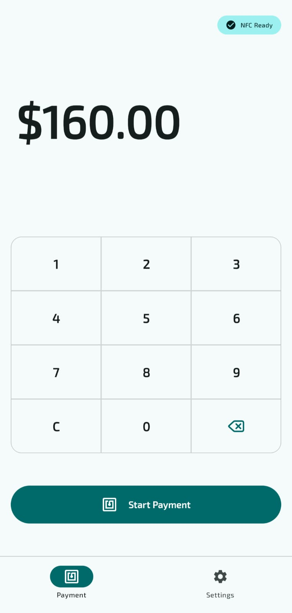
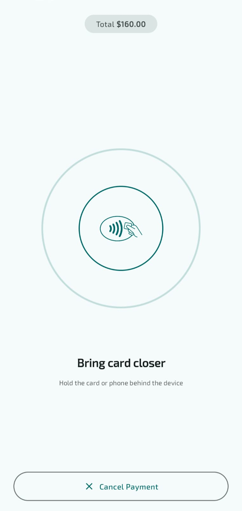
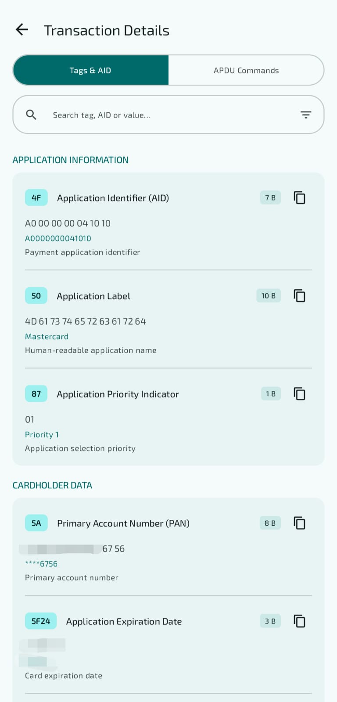
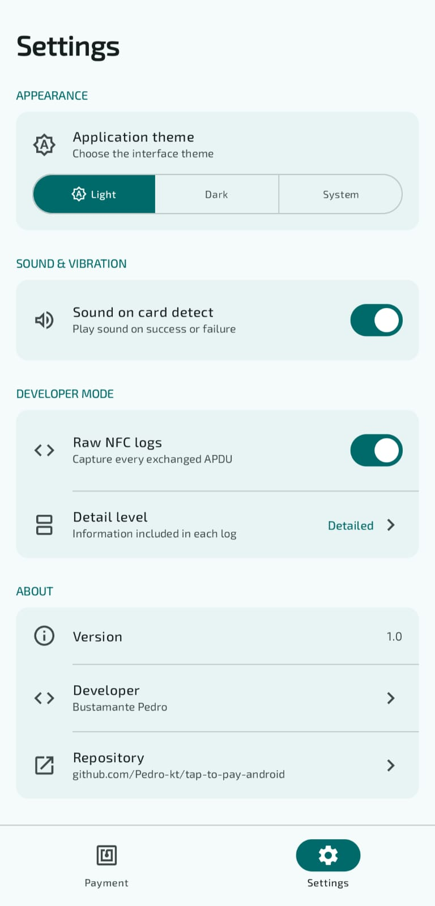

# Tap to Pay Android

<div align="center">

**A modern Android NFC card reader application for reading and parsing EMV contactless payment cards**

[Features](#features) • [Tech Stack](#tech-stack) • [Installation](#installation) • [Disclaimer](#important-disclaimer)

</div>

---

## IMPORTANT DISCLAIMER

**THIS APPLICATION IS FOR EDUCATIONAL AND DEMONSTRATION PURPOSES ONLY.**

- **NOT intended for commercial or production use**
- **Does NOT store or transmit any card data**
- **All processing happens locally on the device**
- **PCI-DSS compliance is NOT guaranteed**
- **User assumes all responsibility for usage**

**By using this application, you acknowledge that it is intended solely for educational purposes to demonstrate NFC and EMV protocol knowledge.**

---

## Screenshots

**Note:** All card data shown in screenshots are test/sample cards, not real payment cards.

<div align="center">
  
  
  
  
</div>

---

## Features

### NFC Card Reading
- **EMV Protocol Support**: Reads contactless payment cards using ISO-DEP technology
- **Real-time Detection**: Instant card detection with visual and audio feedback
- **APDU Command Logging**: Captures all communication between device and card

### Card Data Display
- **Application Information**: AID, application label, and priority indicator
- **Transaction Data**: Card number, expiration date, and card type detection
- **Cardholder Data**: Cardholder name when available
- **EMV Tags Viewer**: Browse all EMV tags organized by category with search functionality

### Modern UI/UX
- **Material Design 3**: Clean, modern interface following Material You guidelines
- **Theme Support**: Light, Dark, and System theme options
- **Reactive Design**: Built entirely with Jetpack Compose
- **Sound Feedback**: Success and failure audio cues (toggleable)

### Developer Features
- **APDU Commands Tab**: View all command-response pairs with status codes
- **Search & Filter**: Find specific tags, AIDs, or APDU commands
- **Detailed Logging**: Configurable log verbosity levels (Not yet implemented)
- **Settings Panel**: Customize app behavior and appearance

---

## Tech Stack

### Language & Technologies
- **Kotlin** 2.0.21
- **Jetpack Compose**
- **Material 3**

### Architecture & Libraries
- **MVVM Pattern** - Clean architecture separation
- **Coroutines** - Asynchronous programming
- **StateFlow** - Reactive state management

### Core Technologies
- **NFC API** - Android NFC framework
- **ISO-DEP** - ISO 14443-4 protocol for contactless cards
- **EMV Parsing** - Custom EMV tag parser implementation

### Tools
- **Gradle KTS**
- **Android Studio** - Koala Feature Drop | 2024.1.2 or higher

---

## Installation

### Prerequisites
- Android device with **NFC capability**
- Android **15.0 (API 35)** or higher
- NFC enabled in device settings

### Build from Source

1. **Clone the repository**
   ```bash
   git clone https://github.com/Pedro-kt/tap-to-pay-android.git
   cd tap-to-pay-android
   ```

2. **Open in Android Studio**
   - Open Android Studio
   - Select "Open an Existing Project"
   - Navigate to the cloned directory

3. **Build and Run**
   - Connect your Android device via USB
   - Click "Run" or press `Shift + F10`
   - Grant NFC permissions when prompted

### APK Release

> Pre-built APKs will be available in the [Releases](https://github.com/Pedro-kt/tap-to-pay-android/releases) section

---

## How It Works

1. **PPSE Selection**: App sends SELECT command for Proximity Payment System Environment
2. **AID Discovery**: Extracts Application Identifier (AID) from PPSE response
3. **Application Selection**: Selects the payment application using discovered AID
4. **GPO Command**: Sends Get Processing Options with PDOL data
5. **Record Reading**: Reads card records from Application File Locator (AFL)
6. **EMV Parsing**: Parses all EMV tags and organizes by category
7. **Data Display**: Shows formatted card information with search capabilities

---

## EMV Tags Supported

The app recognizes and parses EMV tags including:

- **Application Info**: AID (4F), Application Label (50), Priority (87)
- **Transaction Data**: PAN (5A), Expiration (5F24), Service Code (5F30)
- **Cardholder Data**: Name (5F20), Language (5F2D)
- **Card Details**: Track 2 (57), PDOL (9F38), AFL (94)
- And many more...

---

## Contributing

This is primarily a portfolio project, but suggestions and feedback are welcome!

1. Fork the repository
2. Create a feature branch (`git checkout -b feat/AmazingFeature`)
3. Commit your changes with conventional commits (`git commit -m 'feat(feature): description of feature'`)
4. Push to the branch (`git push origin feat/AmazingFeature`)
5. Open a Pull Request

---

## License

This project is licensed under the MIT License - see the [LICENSE](LICENSE) file for details.

---

## Developer

**Bustamante Pedro**

- GitHub: [@Pedro-kt](https://github.com/Pedro-kt)
- Project: [tap-to-pay-android](https://github.com/Pedro-kt/tap-to-pay-android)

---

## Security & Privacy

- **No data storage**: Card data is never persisted to disk
- **No network requests**: All processing is done locally
- **No analytics**: No tracking or telemetry
- **Open source**: Code is fully transparent and auditable

---

## Acknowledgments

- EMV specifications by EMVCo
- Android NFC documentation
- Material Design 3 guidelines
- Jetpack Compose community

---

<div align="center">

**Remember: This is an educational project. Never use it to process real payment transactions.**

Made for learning and demonstration purposes

</div>